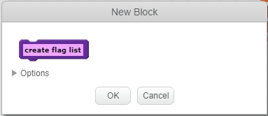
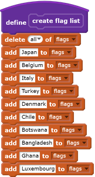
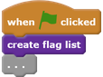

## Create a list of flags

--- task ---
Click on the Scripts tab. There is a list called `flags`{:class="blockdata"}, where you store the names of the countries that your game has flag costumes for.
--- /task ---

--- task ---
Add two more code blocks, one each for the other two flags you created, so there is a total of ten blocks that add all ten countries to the `flags`{:class="blockdata"} list.

--- /task ---

--- task ---
Click the green flag and check that the countries appear in the list.
--- /task ---

If you press the green flag more than once, the countries get added to the list again, and the result is a list of 20 countries instead of 10.

--- task ---
At the start of the code, add a block to `delete all`{:class="blockdata"} of the countries in the list before adding them. This will stop the countries from being added to the list more than once.

--- /task ---

Next, make a custom block. A custom block is a special block with a name. The custom block you'll make will let you create a list of flags using only this one block instead of lots of blocks.

--- task ---
Click on **More Blocks** and then on **Make a Block**. Call your custom block `create flag list`{:class="blockmoreblocks"}.

--- /task ---

--- task ---
Drag all the code away from below the `when flag clicked`{:class="blockevents"} block to below the new `create flag list`{:class="blockmoreblocks"} block.

--- /task ---

--- task ---
Below the `when flag clicked`{:class="blockevents"} block, add the new `create flag list`{:class="blockmoreblocks"} block.

--- /task ---  
